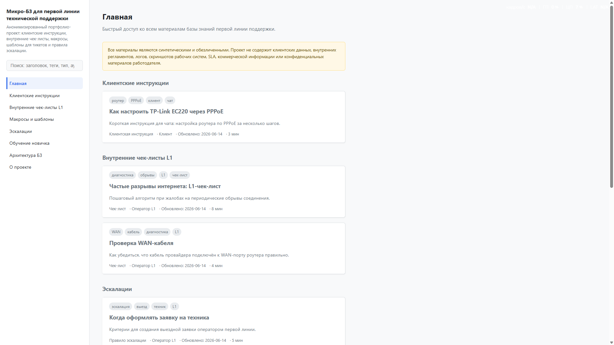
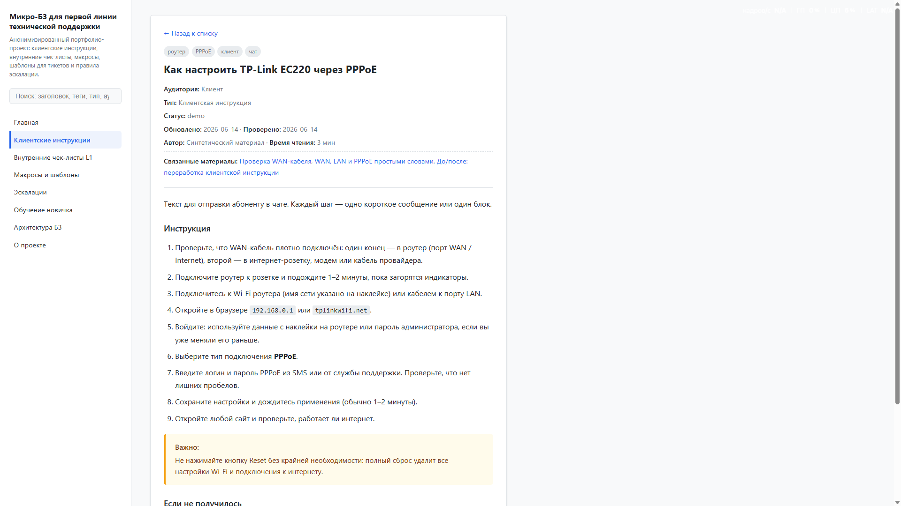
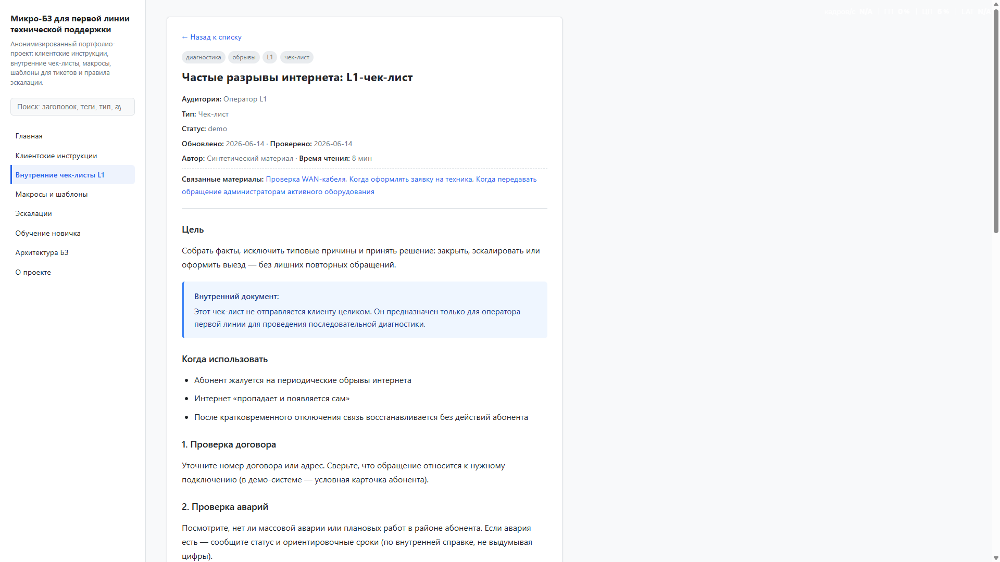
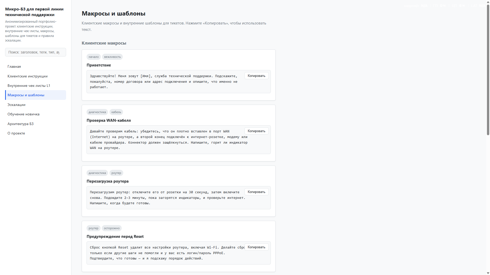

# Микро-БЗ для первой линии поддержки

Демонстрационный пример того, как я структурирую материалы для первой линии поддержки.

Посмотреть проект: https://kawercerion.github.io/l1-support-kb-demo/

Задача этого проекта - показать не сайт, а подход к базе знаний: как разделить клиентские инструкции, внутренние чек-листы, макросы, эскалации и материалы для обучения новичков.

Сайт здесь используется только как удобная оболочка для просмотра материалов.

## Как смотреть проект

1. Откройте главную страницу и посмотрите, как материалы разделены по задачам поддержки.
2. Перейдите в клиентскую инструкцию — там текст написан для абонента без внутреннего жаргона.
3. Перейдите во внутренний L1-чек-лист — там показана логика диагностики для оператора.
4. Откройте макросы — там видны готовые формулировки для чата и тикета.
5. Посмотрите правила эскалации — там описано, когда L1 передаёт обращение дальше.

## Что я показываю

- Как отделять текст для клиента от внутренней инструкции для оператора.
- Как превращать типовое обращение в короткую пошаговую инструкцию.
- Как собирать чек-лист диагностики для L1.
- Как формулировать макросы для чата и тикетов.
- Как описывать условия эскалации.
- Как писать материалы под разные аудитории: клиент, оператор, новичок.

## Что есть в примере

| Материал | Что показывает |
|----------|----------------|
| Клиентская инструкция | Короткий текст без внутреннего жаргона. |
| L1-чек-лист | Последовательность диагностики для оператора. |
| Макросы | Готовые формулировки для чата и тикета. |
| Правила эскалации | Когда обращение нужно передать дальше. |
| Обучение новичка | Объяснение базовых сценариев поддержки. |
| Структура базы знаний | Как разложить материалы по разделам и задачам. |

## Почему такая структура

Материалы разделены по аудиториям и задачам. Клиентские инструкции дают безопасные действия без внутреннего жаргона. Внутренние чек-листы помогают оператору собрать факты и выбрать следующий шаг. Макросы ускоряют типовые ответы, а правила эскалации показывают, когда L1 должен передать обращение дальше.

## Как это выглядело бы в рабочей системе

В рабочей базе знаний такие материалы могли бы храниться в Confluence, Zendesk Guide, Notion или корпоративной БЗ.

В этом репозитории оставлена простая HTML-оболочка без сборки, чтобы быстро показать структуру, тексты и связи между материалами. Цель проекта — база знаний и документация, а не устройство сайта.

## Моя роль

- Продумал структуру базы знаний.
- Разделил материалы по аудиториям.
- Написал клиентские инструкции.
- Составил внутренние чек-листы.
- Подготовил макросы для чата и тикетов.
- Описал правила эскалации.
- Отредактировал тексты под разные сценарии использования.

Веб-оболочка собрана с использованием AI-инструментов и доработана вручную. Она нужна только для удобного просмотра материалов.

Все примеры синтетические и не содержат реальных клиентских данных.

## Как открыть локально

- Открыть `index.html` в браузере.
- Сервер, сборка и зависимости не нужны.

## Скриншоты

### Главная страница

### Клиентская инструкция

### Внутренний чек-лист L1

### Макросы и шаблоны

